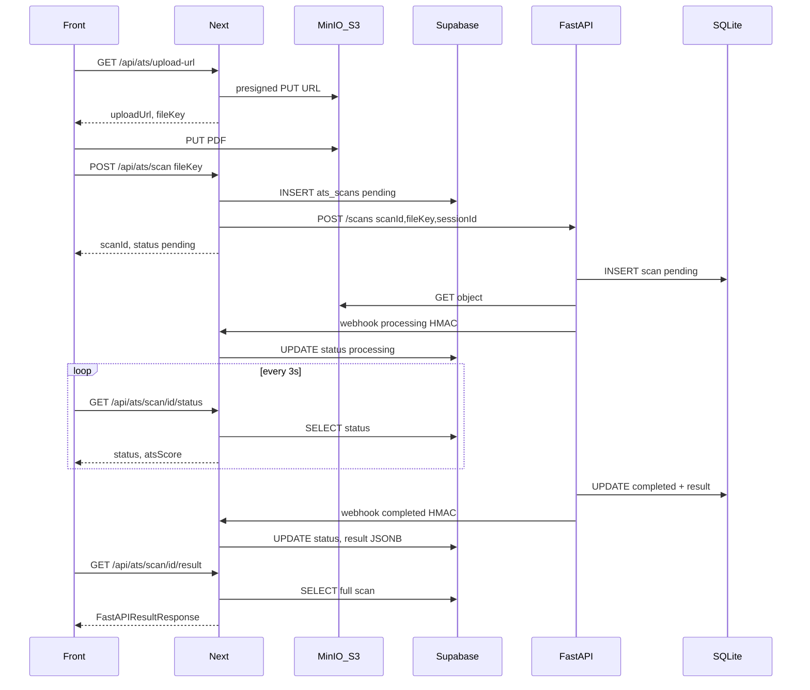

# Plano: Arquitetura ATS Next.js + FastAPI

## Decisões consolidadas

| Aspecto | Decisão |
|---------|---------|
| Upload presigned | Next.js gera PUT URL via S3 SDK (sem proxy FastAPI) |
| Acesso ao PDF | FastAPI lê `bucket + fileKey` com credenciais próprias |
| Source of truth (front) | Supabase `ats_scans` |
| Estado interno FastAPI | SQLite (status + result completo) |
| Sync FastAPI → Next | Webhook HMAC em `processing` + terminal |
| Polling status | Next lê Supabase only |
| Resultado (report) | Nova rota `GET /api/ats/scan/{scanId}/result` no Next |
| Auth | Next valida cookie+session; FastAPI protegido por `X-API-Key` |
| Worker | `BackgroundTasks` + SQLite persistente + re-enfileira pending/processing no startup |
| Agente MVP | LLM parcial (scores/keywords/issues) + `cv_preview` determinístico via parser |
| Legado | Remover `/resume/analyze`; remover rota LGPD delete do Next (fora de escopo) |
| Storage | Mesmo bucket, prefixo `resumes/{sessionId}/{fileKey}` |

## Arquitetura alvo



---

## Fase 1 — Supabase (`mini-app-front`)

Nova migration [`supabase/migrations/20260531000001_create_ats_scans.sql`](mini-app-front/supabase/migrations/20260531000001_create_ats_scans.sql):

```sql
CREATE TABLE ats_scans (
  id                  UUID PRIMARY KEY,           -- scanId gerado pelo Next
  quiz_session_id     UUID NOT NULL REFERENCES quiz_sessions(id) ON DELETE CASCADE,
  file_key            TEXT NOT NULL,
  original_filename   TEXT,
  status              VARCHAR(20) NOT NULL DEFAULT 'pending'
                      CHECK (status IN ('pending','processing','completed','failed')),
  ats_score           SMALLINT,
  job_title_detected  TEXT,
  scanned_at          TIMESTAMPTZ,
  failure_reason      TEXT,
  result              JSONB,                      -- ATSScanResult completo
  created_at          TIMESTAMPTZ NOT NULL DEFAULT NOW(),
  updated_at          TIMESTAMPTZ NOT NULL DEFAULT NOW()
);
CREATE INDEX idx_ats_scans_session ON ats_scans(quiz_session_id);
-- trigger updated_at (reutilizar função existente)
```

Tipos já definidos em [`src/types/quiz.ts`](mini-app-front/src/types/quiz.ts) (`ATSScanResult`, `ATSScanStatus`) e [`src/types/api.ts`](mini-app-front/src/types/api.ts) (`FastAPIResultResponse`) — sem mudança no contrato front.

---

## Fase 2 — Next.js storage + rotas ATS (`mini-app-front`)

### 2.1 Lib S3 compartilhada

Criar [`src/lib/storage.ts`](mini-app-front/src/lib/storage.ts):
- `@aws-sdk/client-s3` + `@aws-sdk/s3-request-presigner`
- Vars: `S3_ENDPOINT`, `S3_BUCKET`, `S3_ACCESS_KEY`, `S3_SECRET_KEY`, `S3_REGION` (default `us-east-1`)
- `buildFileKey(sessionId, uuid)` → `resumes/{sessionId}/{uuid}`
- `getPresignedPutUrl(fileKey, contentType, expiresIn=900)`

### 2.2 Refatorar upload-url

[`src/app/api/ats/upload-url/route.ts`](mini-app-front/src/app/api/ats/upload-url/route.ts):
- **Remover** proxy ao FastAPI
- Gerar UUID + presigned PUT localmente
- Manter resposta `{ uploadUrl, fileKey }` — **zero mudança no front**

### 2.3 Refatorar POST scan

[`src/app/api/ats/scan/route.ts`](mini-app-front/src/app/api/ats/scan/route.ts):
1. Validar session (já existe)
2. Gerar `scanId = crypto.randomUUID()`
3. `INSERT INTO ats_scans` com `status: 'pending'`
4. Chamar FastAPI:

```
POST {FASTAPI_BASE_URL}/scans
Headers: X-API-Key
Body: { scanId, sessionId, fileKey, originalFilename, bucket }
```

5. Retornar `{ scanId, status: 'pending' }` ao front (contrato mantido)

### 2.4 Refatorar polling status

[`src/app/api/ats/scan/[scanId]/status/route.ts`](mini-app-front/src/app/api/ats/scan/[scanId]/status/route.ts):
- **Remover** proxy FastAPI
- Query Supabase: `WHERE id = scanId AND quiz_session_id = session.id`
- Retornar `{ scanId, status, atsScore }` (camelCase)

### 2.5 Nova rota webhook (interna)

Criar [`src/app/api/ats/webhook/route.ts`](mini-app-front/src/app/api/ats/webhook/route.ts):

**Payload esperado:**
```json
{
  "scanId": "uuid",
  "status": "processing" | "completed" | "failed",
  "atsScore": 72,
  "jobTitleDetected": "...",
  "result": { /* ATSScanResult */ },
  "failureReason": "..."
}
```

**Auth:** verificar `X-Webhook-Signature` = HMAC-SHA256(rawBody, `WEBHOOK_SECRET`)

**Ação:** `UPDATE ats_scans SET status, ats_score, result, scanned_at, failure_reason, job_title_detected WHERE id = scanId`

Criar helper [`src/lib/webhook.ts`](mini-app-front/src/lib/webhook.ts) com `verifyWebhookSignature()`.

### 2.6 Nova rota result

Criar [`src/app/api/ats/scan/[scanId]/result/route.ts`](mini-app-front/src/app/api/ats/scan/[scanId]/result/route.ts):
- Validar session + ownership
- Ler Supabase e mapear para `FastAPIResultResponse`
- 404 se scan não pertence à session

### 2.7 Atualizar report page

[`src/app/ats-report/[scanId]/page.tsx`](mini-app-front/src/app/ats-report/[scanId]/page.tsx):
- Trocar `fetchScanResult()` de FastAPI direto para `GET /api/ats/scan/{scanId}/result` (server-side fetch com cookie) **ou** query Supabase inline via helper
- Remover mock fallback de produção (manter só `NODE_ENV=development`)

### 2.8 Remover rota LGPD

Remover [`src/app/api/session/[sessionId]/route.ts`](mini-app-front/src/app/api/session/[sessionId]/route.ts) conforme solicitado.

### 2.9 Env vars novas (Next)

```
S3_ENDPOINT, S3_BUCKET, S3_ACCESS_KEY, S3_SECRET_KEY
WEBHOOK_SECRET          # compartilhado com FastAPI
FASTAPI_BASE_URL          # mantido (só POST /scans)
FASTAPI_API_KEY           # mantido
```

---

## Fase 3 — FastAPI scan worker (`mini-app-api`)

### 3.1 Estrutura de módulos

```
src/
  main.py              # rotas (substituir legado)
  config.py            # Settings expandido
  db/
    sqlite.py          # engine + migrations inline
    models.py          # ScanRecord ORM/dataclass
  storage/
    s3.py              # get_object(bucket, file_key)
  scan/
    service.py         # orquestração do pipeline
    webhook.py         # HMAC client + retry
    schemas.py         # Pydantic ATSScanResult (espelha quiz.ts)
  agent.py             # LLM parcial (scores, keywords, issues)
  resume_parser.py     # reutilizar + extrator cv_preview
```

### 3.2 SQLite schema

Tabela `scans`:
- `id` (PK, scanId vindo do Next)
- `session_id`, `file_key`, `bucket`, `original_filename`
- `status` (`pending|processing|completed|failed`)
- `ats_score`, `job_title_detected`, `failure_reason`
- `result_json` (TEXT/JSON)
- `webhook_processing_sent`, `webhook_terminal_sent` (bool, idempotência)
- `created_at`, `updated_at`, `started_at`, `completed_at`

### 3.3 Endpoint único público

**`POST /scans`** (protegido por middleware `X-API-Key`):

Request:
```json
{
  "scan_id": "uuid-from-next",
  "session_id": "uuid",
  "file_key": "resumes/.../uuid",
  "original_filename": "curriculo.pdf",
  "bucket": "copivaga-resumes"
}
```

Response (202):
```json
{ "scan_id": "...", "status": "pending" }
```

- Persiste no SQLite
- Enfileira `BackgroundTasks` → `process_scan(scan_id)`
- **Remover** rotas `/resume/analyze` e dict in-memory em [`src/main.py`](mini-app-api/src/main.py)

### 3.4 Pipeline `process_scan`

1. Marca `processing` no SQLite
2. Envia webhook `processing` → Next (retry 3x, backoff exponencial)
3. `s3.get_object(bucket, file_key)` → bytes
4. `extract_markdown_from_resume()` ([`src/resume_parser.py`](mini-app-api/src/resume_parser.py))
5. Extrair `cv_preview` deterministicamente do markdown (regex/heurísticas)
6. `run_agent(markdown, quiz_context?)` → scores, keywords, issues, job_title
7. Montar `ATSScanResult` Pydantic
8. Salvar SQLite `completed` + `result_json`
9. Webhook terminal → Next com result completo

Em falha: SQLite `failed` + webhook `{ status: failed, failureReason }`.

### 3.5 Startup recovery

No lifespan/startup do FastAPI:
- Buscar scans com `status IN ('pending', 'processing')`
- Re-enfileirar cada um via BackgroundTasks
- Evita jobs perdidos após restart

### 3.6 Webhook client

[`src/scan/webhook.py`](mini-app-api/src/scan/webhook.py):
- `POST {NEXT_WEBHOOK_URL}` (ex: `http://next:3000/api/ats/webhook`)
- Header `X-Webhook-Signature: sha256=<hex>`
- Retry: 3 tentativas (1s, 3s, 9s)
- Log falha permanente (scan fica completed no SQLite mesmo se webhook falhar — Next polling ficará stale; documentar monitoramento)

### 3.7 Agente LLM parcial

Expandir [`src/agent.py`](mini-app-api/src/agent.py):
- Input: markdown + opcional quiz answers (futuro; MVP pode ignorar)
- Output Pydantic: `overall_score`, `category_scores`, `missing_keywords`, `found_keywords`, `issues[]`, `job_title_detected`
- `cv_preview` **não** vem do LLM — montado pelo parser

### 3.8 Config e deps

Expandir [`src/config.py`](mini-app-api/src/config.py) e [`pyproject.toml`](mini-app-api/pyproject.toml):

```
# FastAPI
API_KEY, SQLITE_PATH, NEXT_WEBHOOK_URL, WEBHOOK_SECRET
S3_ENDPOINT, S3_BUCKET, S3_ACCESS_KEY, S3_SECRET_KEY
OPENAI_API_KEY (ou provider LLM)
```

Adicionar deps: `boto3`, `httpx`, `aiosqlite` (ou `sqlalchemy`).

Atualizar [`.env.example`](mini-app-api/.env.example) em ambos repos.

---

## Fase 4 — Contrato front ↔ API (sem breaking changes)

O front ([`upload-form.tsx`](mini-app-front/src/features/upload/upload-form.tsx), [`ats-loading/page.tsx`](mini-app-front/src/app/ats-loading/page.tsx)) **não precisa mudar** exceto report page:

| Etapa | Rota front | Mudança |
|-------|-----------|---------|
| Upload URL | `GET /api/ats/upload-url` | Nenhuma (implementação interna) |
| Upload PUT | presigned URL | Nenhuma |
| Iniciar scan | `POST /api/ats/scan` | Nenhuma |
| Polling | `GET /api/ats/scan/{id}/status` | Nenhuma |
| Report | `/ats-report/[scanId]` | Trocar fetch de FastAPI → Next API route |

---

## Fase 5 — Testes e validação

**Next.js:**
- Unit: HMAC verify, presigned URL generation (mock S3)
- Integration: webhook handler atualiza Supabase

**FastAPI:**
- Unit: webhook sign, ATSScanResult schema, cv_preview extractor
- Integration: POST /scans → mock S3 → mock LLM → webhook mock server
- Startup recovery: insert pending scan, restart app, assert re-processed

**E2E local:**
1. Subir MinIO + Supabase + Next + FastAPI
2. Fluxo completo com PDF real
3. Validar polling → completed → report render

Manter [`mock-ats-api/server.js`](mini-app-front/mock-ats-api/server.js) para dev front-only; não precisa espelhar nova arquitetura.

---

## Ordem de implementação sugerida

1. Migration Supabase `ats_scans`
2. Next: `lib/storage.ts` + refatorar upload-url
3. FastAPI: SQLite + POST /scans + S3 fetch + remover legado
4. FastAPI: pipeline scan + webhook client
5. Next: webhook handler + refatorar scan route
6. Next: status route (Supabase) + result route
7. Next: report page
8. Agente LLM parcial + cv_preview extractor
9. Startup recovery + testes

---

## Riscos e mitigações

| Risco | Mitigação |
|-------|-----------|
| Webhook falha → Supabase stale | Log + alerta; FastAPI retenta 3x; futuro: job reconciler |
| Upload órfão no S3 | TTL lifecycle rule no bucket (fora de escopo MVP) |
| Restart mid-scan | Startup re-enfileira pending/processing |
| LLM lento/caro | Timeout no worker; status `failed` com reason |
