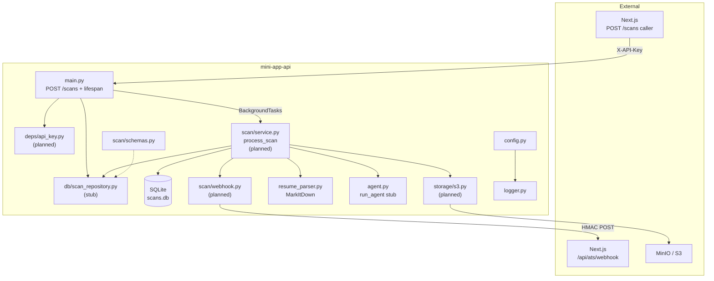

# Architecture

**Pattern:** Single-process background scan worker — FastAPI accepts scan jobs, persists state in SQLite, processes in `BackgroundTasks`, and notifies Next.js via HMAC webhooks.

## High-Level Structure



## Identified Patterns

### App Factory

**Location:** `src/app.py`
**Purpose:** Isolate FastAPI instantiation; attach lifespan for DB init and startup recovery.
**Implementation:** `get_app() -> FastAPI`; lifespan planned to call `init_db(engine)` and re-enqueue incomplete scans.
**Example:** Routes attach to `app` in `src/main.py`.

### SQLAlchemy persistence layer

**Location:** `src/db/`
**Purpose:** Durable scan lifecycle with startup recovery.
**Implementation:**

- `models.py` — `Scan` ORM model with status, result JSON, webhook idempotency flags, timestamps.
- `engine.py` — `create_db_engine`, `init_db`, `get_session_factory`.
- `scan_repository.py` — **stub only** (`class ScanRepository: pass`); integration tests define expected behaviour.
  **Example:** `Scan` table with index `idx_scans_status`.

### Pydantic domain schemas

**Location:** `src/scan/schemas.py`
**Purpose:** Request/response and webhook DTOs for the scan pipeline.
**Implementation:** `CreateScanRequest`, `ATSScanResult`, `AgentResult`, webhook payloads with camelCase fields for outbound JSON.
**Example:** `AgentResult` includes `cv_preview` from the single LLM structured-output call; `ATSScanResult` maps agent output directly.

### Structured logging with domain binding

**Location:** `src/logger.py`
**Purpose:** Consistent, environment-aware logging across modules.
**Implementation:** `configure_logging()` once; `get_logger(domain)` returns bound structlog logger. Dev uses custom `DevRenderer`; prod uses JSON.
**Example:** `logger = get_logger("scan"); log = logger.bind(scan_id=scan_id)`.

### Resume extraction pipeline

**Location:** `src/resume_parser.py`
**Purpose:** Convert PDF/DOCX bytes (from S3) to markdown text.
**Implementation:** Singleton `MarkItDown()` converter; extension validation; stream conversion via `BytesIO`.
**Example:** `extract_markdown_from_resume(content, filename)`.

### Agent stub (placeholder)

**Location:** `src/agent.py`
**Purpose:** LLM analysis of resume markdown.
**Implementation:** LangChain `PromptTemplate` defined but unused; `run_agent()` returns hardcoded string (target: `AgentResult`).
**Example:** Planned signature: `run_agent(markdown: str) -> AgentResult`.

### Test-first repository contract

**Location:** `tests/integration/test_scan_repository.py`
**Purpose:** Define `ScanRepository` behaviour before implementation (TDD).
**Implementation:** Tests import `ScanCreate`, `DuplicateScanError`, and lifecycle methods; assert via raw SQL helpers (`_fetch_scan`) to avoid round-trip bugs.
**Example:** `test_raises_duplicate_scan_error_when_scan_already_exists`.

## Data Flow

### Scan worker (happy path)

```
Next.js
  → POST /scans (X-API-Key, scan metadata)
    → ScanRepository.insert_pending
    → BackgroundTasks process_scan
  ← 202 { scan_id, status: pending }

Background: process_scan
  → mark_processing + processing webhook (idempotent)
  → S3 GetObject → extract_markdown + run_agent (scores + cv_preview)
  → mark_completed/failed + terminal webhook (idempotent)

Startup lifespan
  → init_db(engine)
  → re-enqueue pending/processing scans
```

### Configuration bootstrap

```
App import
  → configure_logging() (reads Settings from .env)
  → get_app() + lifespan + route registration
```

## Code Organization

**Approach:** Domain packages under `src/` (`db/`, `scan/`) plus shared modules. Planned additions: `storage/`, `deps/`, `scan/service.py`, `scan/webhook.py`.

**Structure:**

| Module / Package        | Responsibility                                       |
| ----------------------- | ---------------------------------------------------- |
| `main.py`               | HTTP routes (`POST /scans`), lifespan, app bootstrap |
| `app.py`                | FastAPI factory + lifespan                           |
| `config.py`             | Settings via pydantic-settings                       |
| `logger.py`             | structlog setup and helpers                          |
| `resume_parser.py`      | File validation and MarkItDown conversion            |
| `agent.py`              | LLM agent (stub)                                     |
| `db/models.py`          | SQLAlchemy `Scan` model                              |
| `db/engine.py`          | SQLite engine factory and schema init                |
| `db/scan_repository.py` | Scan persistence (stub)                              |
| `scan/schemas.py`       | Pydantic DTOs for scans, results, webhooks           |

**Module boundaries:** Repository handles persistence; service layer orchestrates S3 fetch, parsing, agent, and webhooks. Only the repository interface is test-defined so far.

## Reference

Feature spec and design: `.specs/features/ats-scan-worker/` (spec, design, tasks).
