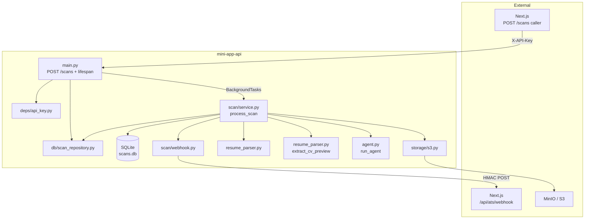
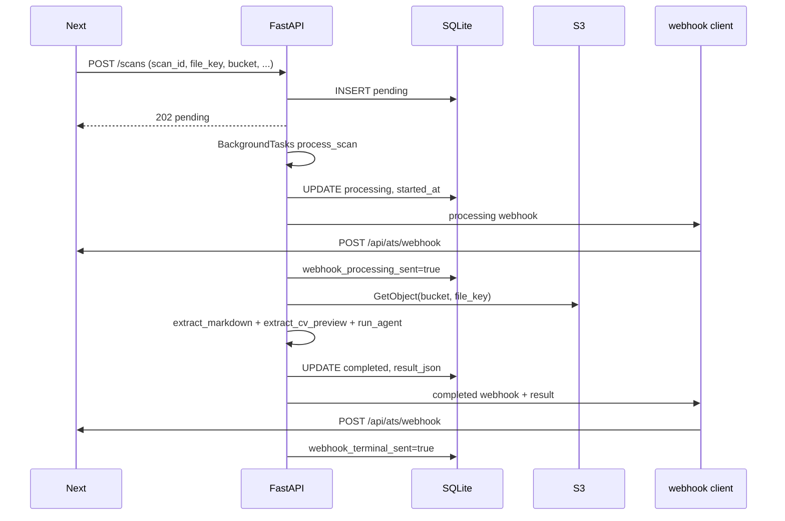
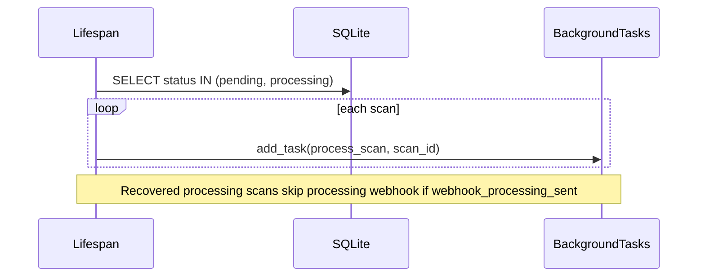

# ATS Scan Worker — Design

**Spec**: `.specs/features/ats-scan-worker/spec.md`  
**Plan**: `.cursor/plans/ats_backend_architecture_a67b1165.plan.md` (Fase 3 + 5)  
**Status**: Draft  
**Scope**: `mini-app-api` only

---

## Architecture Overview

FastAPI evolves from a multipart upload + in-memory job poller into a **single-process background scan worker**. Next.js remains the orchestrator: it owns Supabase and presigned S3 uploads. This service accepts scan jobs via `POST /scans`, persists state in SQLite, fetches PDFs from S3 with its own credentials, runs the analysis pipeline in `BackgroundTasks`, and pushes lifecycle updates to Next.js via HMAC-signed webhooks.

There is no public read API for scan results — Next.js reads from Supabase after webhooks land.



### End-to-end sequence (happy path)



### Startup recovery



---

## Code Reuse Analysis

### Existing components to leverage

| Component | Location | How to use |
|-----------|----------|------------|
| App factory | `src/app.py` | Extend `get_app()` with `lifespan` for DB init + recovery |
| Settings pattern | `src/config.py` | Expand `Settings` with ATS/S3/webhook fields; fail-fast validators |
| Structured logging | `src/logger.py` | `get_logger("scan")`, bind `scan_id=` on all pipeline logs |
| PDF/DOCX → markdown | `src/resume_parser.py` | Reuse `extract_markdown_from_resume(bytes, filename)` unchanged |
| Extension validation | `src/resume_parser.py` | Reuse `validate_resume_filename` when deriving ext from `original_filename` |
| Agent entry point | `src/agent.py` | Change signature to `run_agent(markdown: str) -> AgentResult`; P1 stub, P2 real LLM |
| LangChain prompt | `src/agent.py` | Replace template in P2 with ATS structured-output prompt |

### Integration points

| System | Method | Notes |
|--------|--------|-------|
| Next.js | `POST /scans` inbound | `X-API-Key` auth; body snake_case |
| Next.js | `POST {NEXT_WEBHOOK_URL}` outbound | camelCase JSON; `X-Webhook-Signature: sha256=<hex>` |
| S3/MinIO | `boto3` `get_object` | Bucket from request body; credentials from env |
| SQLite | file at `SQLITE_PATH` | Single-writer; no horizontal scaling in MVP |

### CONCERNS.md mitigations

| Concern | Design response |
|---------|-----------------|
| In-memory `jobs` dict | Removed entirely; SQLite `ScanRepository` is sole state |
| `print(markdown)` PII leak | Removed; optional `log.debug("markdown_extracted", length=len(markdown))` |
| No API auth | `verify_api_key` dependency on `POST /scans` only |
| Sync MarkItDown in background | Accept for MVP; same as today; optional `asyncio.to_thread` deferred |
| Lint tools in runtime deps | Move `mypy`, `black`, `isort` to `[tool.poetry.group.dev.dependencies]` |
| Global mutable state races | Repository encapsulates DB access; no module-level job dict |

---

## Tech Decisions

| Decision | Choice | Rationale |
|----------|--------|-----------|
| SQLite access | SQLAlchemy 2.0 ORM + sync `Session` | Sync pipeline in `BackgroundTasks`; shared ORM models for production and tests; avoids hand-written SQL for one table |
| S3 client | `boto3` | Plan-aligned; sync `get_object` fits background task |
| HTTP webhook client | `httpx` sync client | Simple retries in sync `process_scan`; `httpx.post` with timeout |
| Schema migration | `Base.metadata.create_all()` on startup | No Alembic for MVP; schema defined in `db/models.py` |
| API key enforcement | FastAPI `Depends(verify_api_key)` | Matches existing dependency style; easy to test with `app.dependency_overrides` |
| Request/response naming | snake_case on `POST /scans`; camelCase on webhooks | Matches Next.js route expectations per plan |
| Canonical result contract | `mini-app-front/src/types/quiz.ts` | Spec example JSON is illustrative only — **quiz.ts wins** over spec's simplified `cv_preview` / `category_scores` example |
| P1 agent | Stub returning valid `AgentResult` (zeros/empty) | Pipeline + webhooks testable without LLM; satisfies ATS-10 at integration level |
| P2 agent | LangChain + OpenAI (or env-configured provider) | Already in dependencies; structured JSON output parsed into Pydantic |
| Idempotency | DB columns `webhook_processing_sent`, `webhook_terminal_sent` | Survives crash between webhook send and SQLite flag update (see recovery note below) |
| No GET /scans/{id} | By design | Next reads Supabase; reduces API surface |

### Contract alignment note (spec vs frontend)

The spec's ATSScanResult example uses simplified `category_scores` keys (`format`, `sections`) and a minimal `cv_preview` (`sections: string[]`). The **implemented Pydantic models must mirror `quiz.ts`**:

- `ATSCategoryKey`: `keywords`, `formatting`, `content`, `professional_experience`, `header_contact`, `professional_summary`, `skills`, `education`
- `ATSIssue`: `id`, `category`, `severity` (`critical` \| `warning` \| `info`), `description`, `solution`
- `CVPreview`: full structure with `contact: CVContactItem[]`, `experience`, `education`, etc.

P2 `extract_cv_preview` targets the full `CVPreview` shape. P1 may populate sparse defaults (empty arrays, `name=""`) so webhooks validate.

---

## Module Layout

```
src/
  main.py                 # POST /scans, lifespan, wire dependencies
  app.py                  # get_app(lifespan=...)
  config.py               # expanded Settings + fail-fast
  deps/
    api_key.py            # verify_api_key header dependency
  db/
    models.py             # DeclarativeBase, Scan ORM model
    engine.py             # create_engine, init_db, session factory
    scan_repository.py    # ScanRepository CRUD
  storage/
    s3.py                 # fetch_object(bucket, key) -> bytes
  scan/
    schemas.py            # request/response + ATSScanResult domain models
    service.py            # process_scan orchestration
    webhook.py            # sign + send + retry
  agent.py                # run_agent -> AgentResult
  resume_parser.py        # existing + extract_cv_preview (P2)
```

`main.py` stays thin: route handlers + lifespan only. Business logic lives in `scan/service.py`.

---

## Components

### `Settings` (`config.py`)

- **Purpose**: Centralize env config with startup validation.
- **Interfaces**:
  - `get_settings() -> Settings` (cached)
  - Required fields raise `pydantic.ValidationError` at import if missing: `api_key`, `next_webhook_url`, `webhook_secret`, `s3_endpoint`, `s3_bucket`, `s3_access_key`, `s3_secret_key`
  - P2: `openai_api_key` required when `agent_mode=llm` (or always required post-P2)
- **New fields**:

| Field | Env | Default |
|-------|-----|---------|
| `api_key` | `API_KEY` | required |
| `sqlite_path` | `SQLITE_PATH` | `data/scans.db` |
| `next_webhook_url` | `NEXT_WEBHOOK_URL` | required |
| `webhook_secret` | `WEBHOOK_SECRET` | required |
| `s3_endpoint` | `S3_ENDPOINT` | required |
| `s3_bucket` | `S3_BUCKET` | required (default bucket fallback; request may override per scan) |
| `s3_access_key` | `S3_ACCESS_KEY` | required |
| `s3_secret_key` | `S3_SECRET_KEY` | required |
| `s3_region` | `S3_REGION` | `us-east-1` |
| `openai_api_key` | `OPENAI_API_KEY` | optional P1; required P2 |

- **Reuses**: Existing `Settings` + `pydantic-settings` pattern.

---

### `verify_api_key` (`deps/api_key.py`)

- **Purpose**: Reject unauthenticated scan registration.
- **Interfaces**:
  - `async def verify_api_key(x_api_key: str = Header(..., alias="X-API-Key")) -> None` — raises `HTTPException(401)` if mismatch
- **Dependencies**: `settings.api_key`
- **Reuses**: FastAPI `Header` + `HTTPException` pattern from conventions.

---

### `models.py` + `engine.py` + `ScanRepository` (`db/`)

- **Purpose**: Persistent scan records and webhook idempotency flags via SQLAlchemy ORM.
- **Interfaces**:

```python
# db/models.py
class Base(DeclarativeBase): ...

class Scan(Base):
    __tablename__ = "scans"
    # columns per Data Models § SQLite table `scans`

# db/engine.py
def create_db_engine(path: Path) -> Engine: ...
def init_db(engine: Engine) -> None: ...              # Base.metadata.create_all; idempotent
def get_session_factory(engine: Engine) -> sessionmaker[Session]: ...

# db/scan_repository.py
class ScanRepository:
    def __init__(self, session: Session): ...
    def insert_pending(self, record: ScanCreate) -> None: ...          # raises DuplicateScanError
    def get_by_id(self, scan_id: str) -> ScanRecord | None: ...
    def list_incomplete(self) -> list[ScanRecord]: ...                 # pending + processing
    def mark_processing(self, scan_id: str) -> ScanRecord: ...
    def mark_completed(self, scan_id: str, result: ATSScanResult, ...) -> None: ...
    def mark_failed(self, scan_id: str, reason: str) -> None: ...
    def mark_webhook_processing_sent(self, scan_id: str) -> None: ...
    def mark_webhook_terminal_sent(self, scan_id: str) -> None: ...
```

- **Dependencies**: `sqlalchemy`, `Settings.sqlite_path` (ensure parent dir exists before `create_engine`).
- **Reuses**: None — replaces `jobs` dict.

**Session lifecycle**: App lifespan creates one `Engine` and `sessionmaker` on `app.state`. Callers (`POST /scans`, `process_scan`, recovery) open a `Session` from the factory, pass it to `ScanRepository`, commit in repository methods, and close the session in a `try/finally` (or equivalent context manager).

**Concurrency**: Single process, single writer. No `check_same_thread=False` needed when all DB access stays on the main thread / background task thread sequentially per scan.

---

### `fetch_object` (`storage/s3.py`)

- **Purpose**: Download resume bytes for pipeline.
- **Interfaces**:
  - `def fetch_object(bucket: str, file_key: str) -> bytes`
  - Raises `S3ObjectNotFoundError` (wraps `ClientError` 404) with message `S3 object not found: {file_key}`
- **Dependencies**: boto3 client built from settings (`endpoint_url`, credentials, region).
- **Reuses**: None.

---

### Pydantic schemas (`scan/schemas.py`)

- **Purpose**: HTTP contracts + domain result type.
- **Interfaces**:

```python
class CreateScanRequest(BaseModel):
    scan_id: UUID
    session_id: UUID
    file_key: str = Field(min_length=1)
    original_filename: str = Field(min_length=1)
    bucket: str = Field(min_length=1)

class CreateScanResponse(BaseModel):
    scan_id: UUID
    status: Literal["pending"]

# Domain — mirrors quiz.ts (snake_case fields in JSON stored in SQLite)
class ATSIssue(BaseModel): ...
class CVContactItem(BaseModel): ...
class CVPreview(BaseModel): ...
class ATSScanResult(BaseModel):
    overall_score: int = Field(ge=0, le=100)
    category_scores: dict[str, int]
    missing_keywords: list[str]
    found_keywords: list[str]
    issues: list[ATSIssue]
    cv_preview: CVPreview

class AgentResult(BaseModel):
    """LLM output only — no cv_preview."""
    overall_score: int
    category_scores: dict[str, int]
    missing_keywords: list[str]
    found_keywords: list[str]
    issues: list[ATSIssue]
    job_title_detected: str | None
```

- **Webhook DTOs** (camelCase, separate models or `model_config` aliases):

```python
class WebhookProcessingPayload(BaseModel):
    scanId: str
    status: Literal["processing"]

class WebhookCompletedPayload(BaseModel):
    scanId: str
    status: Literal["completed"]
    atsScore: int
    jobTitleDetected: str | None
    result: ATSScanResult  # serialized with alias if needed

class WebhookFailedPayload(BaseModel):
    scanId: str
    status: Literal["failed"]
    failureReason: str
```

- **Reuses**: Pydantic v2 patterns from existing `JobCreateResponse`.

---

### `process_scan` (`scan/service.py`)

- **Purpose**: Orchestrate pipeline; single entry for background work and recovery.
- **Interfaces**:
  - `def process_scan(scan_id: str, repo: ScanRepository, settings: Settings) -> None`
- **Algorithm**:

```
1. record = repo.get_by_id(scan_id) or return
2. if record.status == completed|failed: return  # already terminal
3. repo.mark_processing(scan_id)
4. if not record.webhook_processing_sent:
       send_webhook(processing)
       repo.mark_webhook_processing_sent(scan_id)
5. try:
       bytes = fetch_object(record.bucket, record.file_key)
       md = extract_markdown_from_resume(bytes, record.original_filename)
       preview = extract_cv_preview(md)          # P1: sparse stub; P2: real
       agent_out = run_agent(md)                 # P1: stub; P2: LLM
       result = ATSScanResult(
           overall_score=agent_out.overall_score,
           category_scores=agent_out.category_scores,
           missing_keywords=agent_out.missing_keywords,
           found_keywords=agent_out.found_keywords,
           issues=agent_out.issues,
           cv_preview=preview,
       )
       repo.mark_completed(scan_id, result, job_title=agent_out.job_title_detected)
   except Exception as exc:
       repo.mark_failed(scan_id, str(exc))
       send terminal failed webhook; mark terminal sent; return
6. send terminal completed webhook with result + atsScore + jobTitleDetected
7. repo.mark_webhook_terminal_sent(scan_id)
```

- **Dependencies**: repository, s3, parser, agent, webhook client, logger.
- **Reuses**: `extract_markdown_from_resume`; replaces `process_resume`.

**Recovery rule (ATS-24)**: On step 4, skip if `webhook_processing_sent` is already true — resume from S3 fetch without re-notifying Next.js.

**Idempotency edge case**: If webhook succeeds but process crashes before flag update, recovery may resend `processing` once. Acceptable for MVP; optional future: persist webhook attempt log.

---

### Webhook client (`scan/webhook.py`)

- **Purpose**: HMAC-signed outbound notifications with retries.
- **Interfaces**:

```python
def sign_payload(body: bytes, secret: str) -> str:
    """Returns 'sha256=' + hmac_hex."""

def send_webhook(payload: BaseModel, settings: Settings) -> bool:
    """POST JSON; retry 3x on failure with sleeps 1, 3, 9 seconds.
    Returns True if 2xx received. Logs error and returns False if exhausted."""

def send_processing(scan_id: str, settings: Settings) -> bool: ...
def send_completed(scan_id: str, record: ScanRecord, result: ATSScanResult, settings: Settings) -> bool: ...
def send_failed(scan_id: str, reason: str, settings: Settings) -> bool: ...
```

- **Signing**: `HMAC-SHA256(raw_utf8_body, WEBHOOK_SECRET)` → header `X-Webhook-Signature: sha256=<hex>` (lowercase hex, per spec).
- **Dependencies**: `httpx`, `settings.next_webhook_url`, `settings.webhook_secret`.
- **Reuses**: structlog for permanent failure log (ATS-20).

---

### `run_agent` (`agent.py`)

- **Purpose**: Produce scoring/keywords/issues/job title from markdown.
- **Interfaces**:
  - P1: `def run_agent(markdown: str) -> AgentResult` — deterministic stub (zeros, empty lists, `job_title_detected=None`)
  - P2: LLM call with JSON schema / structured output → `AgentResult`; raises on timeout/error
- **Dependencies**: P2 — `OPENAI_API_KEY`, LangChain chat model.
- **Reuses**: LangChain `PromptTemplate` replaced with structured prompt.

---

### `extract_cv_preview` (`resume_parser.py`)

- **Purpose**: Build `CVPreview` without LLM (P2).
- **Interfaces**:
  - `def extract_cv_preview(markdown: str) -> CVPreview`
- **P1 stub**: Return empty-safe `CVPreview(name="", contact=[], experience=[], education=[])`.
- **P2 heuristics**: Parse first `#`/`##` heading as name; regex emails/phones into `CVContactItem`; split on `##` for sections → map to `experience` / `education` / `skills` where possible.
- **Reuses**: Markdown structure from MarkItDown output.

---

### HTTP routes + lifespan (`main.py`, `app.py`)

- **Purpose**: Public API surface and startup recovery.
- **Interfaces**:

```python
@asynccontextmanager
async def lifespan(app: FastAPI):
    engine = create_db_engine(settings.sqlite_path)
    init_db(engine)
    app.state.engine = engine
    app.state.session_factory = get_session_factory(engine)
    with app.state.session_factory() as session:
        repo = ScanRepository(session)
        incomplete = repo.list_incomplete()
    log count or "No incomplete scans to recover"
    for scan in incomplete:
        background_tasks.add_task(process_scan, scan.id)  # process_scan opens its own session
    yield
    app.state.engine.dispose()

@app.post("/scans", status_code=202, dependencies=[Depends(verify_api_key)])
async def create_scan(body: CreateScanRequest, background_tasks: BackgroundTasks) -> CreateScanResponse:
    repo.insert_pending(...)  # 409 on duplicate
    background_tasks.add_task(process_scan, str(body.scan_id))
    return CreateScanResponse(scan_id=body.scan_id, status="pending")
```

- **Removed**: `POST /resume/analyze`, `GET /resume/analyze/{job_id}`, module-level `jobs`.
- **Reuses**: `get_app()`, `BackgroundTasks`, existing logging bootstrap.

**Lifespan + BackgroundTasks**: Store `engine` and `session_factory` on `app.state`. Each handler / background task opens a fresh `Session`, constructs `ScanRepository(session)`, and closes the session after work completes. Recovery enqueues tasks during startup the same way as `create_scan`.

---

## Data Models

### ORM model `Scan` (`db/models.py`)

Maps to SQLite table `scans` (SQLAlchemy `Mapped` columns):

| Column | SQLAlchemy type | Notes |
|--------|-----------------|-------|
| `id` | `Mapped[str]` PK | UUID string from Next (`scan_id`) |
| `session_id` | `Mapped[str]` | |
| `file_key` | `Mapped[str]` | e.g. `resumes/{sessionId}/{uuid}` |
| `bucket` | `Mapped[str]` | |
| `original_filename` | `Mapped[str]` | Used for extension validation |
| `status` | `Mapped[str]` | `pending`, `processing`, `completed`, `failed` |
| `ats_score` | `Mapped[int | None]` | Denormalized from result |
| `job_title_detected` | `Mapped[str | None]` | |
| `failure_reason` | `Mapped[str | None]` | |
| `result_json` | `Mapped[str | None]` | JSON serialized `ATSScanResult` |
| `webhook_processing_sent` | `Mapped[bool]` | Default `False` |
| `webhook_terminal_sent` | `Mapped[bool]` | Default `False` |
| `created_at` | `Mapped[str]` | ISO-8601 UTC |
| `updated_at` | `Mapped[str]` | |
| `started_at` | `Mapped[str | None]` | Set on processing |
| `completed_at` | `Mapped[str | None]` | Set on terminal state |

**Indexes**: `Index("idx_scans_status", Scan.status)` on the model for recovery query.

### `ScanRecord` (repository dataclass)

Maps ORM `Scan` row ↔ domain type for service logic; exposes `webhook_processing_sent: bool` and `result: ATSScanResult | None` (parsed from `result_json`).

---

## Error Handling Strategy

| Scenario | Handling | SQLite | Webhook |
|----------|----------|--------|---------|
| Missing/invalid API key | HTTP 401 | — | — |
| Invalid body / non-UUID `scan_id` | HTTP 422 | — | — |
| Duplicate `scan_id` | HTTP 409 | — | — |
| S3 404 | `S3ObjectNotFoundError` → failed | `status=failed`, reason prefixed | `failed` |
| Empty markdown / parse error | `ValueError` caught | `failed` | `failed` |
| LLM error (P2) | Exception caught | `failed` | `failed` |
| Webhook non-2xx / network | Retry 1s, 3s, 9s; log error | Terminal status **unchanged** | May be missing on Next side |
| Successful pipeline, webhook exhausted | Log error | `completed` remains | Next stale — ops monitor |

All pipeline exceptions use `failure_reason=str(exc)` (ATS-13). No stack traces in webhook payload.

---

## Authentication & Security

| Surface | Mechanism |
|---------|-----------|
| `POST /scans` | `X-API-Key: <API_KEY>` |
| Outbound webhooks | `X-Webhook-Signature: sha256=<hmac(body)>` |
| S3 | IAM-style keys in env; never forwarded from Next request beyond bucket name |

Do not log markdown body at INFO. Do not log webhook secret or API key.

---

## Dependencies (`pyproject.toml`)

**Add runtime:**

- `boto3` — S3 get_object
- `httpx` — webhook HTTP
- `sqlalchemy` — ORM + sync SQLite engine/session

**Move to dev group:**

- `mypy`, `black`, `isort`

**Optional P2:**

- `openai` or provider package if not pulled transitively by LangChain

**No add:**

- `aiosqlite` (sync SQLAlchemy sufficient for MVP)

---

## Testing Strategy (P3)

Align with `.specs/codebase/TESTING.md`:

| Test file | Covers | Technique |
|-----------|--------|-----------|
| `tests/integration/conftest.py` | In-memory SQLAlchemy engine + `db_session` fixture | `StaticPool` + `init_db()` — same path as production |
| `tests/conftest.py` | Temp SQLite file, `TestClient`, settings override | `tmp_path` + `dependency_overrides` |
| `tests/integration/test_scan_repository.py` | Repository CRUD | Real `Session` + `ScanRepository` |
| `tests/test_scans_route.py` | ATS-01–05 | TestClient; 401/409/202 |
| `tests/test_webhook.py` | ATS-15–20 | Unit-test `sign_payload`; mock `httpx` |
| `tests/test_cv_preview.py` | ATS-33–35 (P2) | Direct function call + fixture markdown |
| `tests/test_process_scan.py` | ATS-06–14, ATS-24 | Mock S3, agent, webhook; real SQLAlchemy session |

**Isolation**: Each test gets a fresh in-memory engine (`StaticPool`) or temp SQLite file. No shared module-level `jobs` dict.

**Gate**: `poetry run pytest -q` exits 0.

Update `tests/http/start.http` → new `tests/http/scans.http` for manual smoke (optional, non-blocking).

---

## Implementation Phases (maps to spec priorities)

| Phase | Deliverables | Requirements |
|-------|--------------|--------------|
| **P1a** | `config`, `db`, `schemas`, `POST /scans`, remove legacy routes | ATS-01–05, ATS-25–28 |
| **P1b** | `s3`, `service.process_scan` stub agent + stub cv_preview | ATS-06–14 |
| **P1c** | `webhook.py` | ATS-15–21 |
| **P1d** | Lifespan recovery | ATS-22–24 |
| **P2** | Real `run_agent`, `extract_cv_preview` | ATS-29–35 |
| **P3** | pytest suite | ATS-36–37 |

---

## Deferred / Out of Scope (unchanged from spec)

- Next.js routes, Supabase migration, presigned upload
- Multi-worker / queue (Redis, Celery)
- GET `/scans/{id}` on FastAPI
- Quiz context in LLM prompt
- Orphan S3 cleanup
- Webhook reconciler job

---

## Open Questions

| # | Question | Recommendation |
|---|----------|----------------|
| OQ-1 | Should P1 `cv_preview` stub satisfy full `CVPreview` or minimal subset? | Full model with empty arrays — validates webhook JSON against Next types |
| OQ-2 | `category_scores` keys: require all 8 `ATSCategoryKey` values or sparse dict? | P1 stub returns all keys at 0; P2 LLM prompt lists allowed keys |
| OQ-3 | Agent issue `id` generation | UUID4 in agent post-process if LLM omits ids |

No `context.md` exists — no user-locked decisions beyond spec + plan.

---

## Requirement Traceability (design mapping)

Design covers all P1 requirements (ATS-01–28). P2/P3 mapped to implementation phases above. Detailed task breakdown: `.specs/features/ats-scan-worker/tasks.md` (18 tasks, T1–T18).

| Req ID | Design section |
|--------|----------------|
| ATS-01–05 | `POST /scans`, `ScanRepository.insert_pending`, `verify_api_key` |
| ATS-06–14 | `scan/service.py` pipeline |
| ATS-15–21 | `scan/webhook.py` |
| ATS-22–24 | `lifespan` + recovery skip logic in `process_scan` |
| ATS-25–28 | Legacy removal + `pyproject.toml` dev deps |
| ATS-29–35 | `agent.py`, `extract_cv_preview` (P2) |
| ATS-36–37 | Testing strategy |
